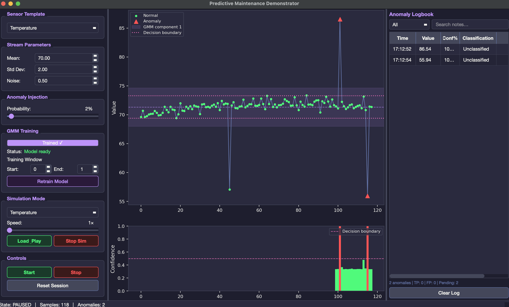
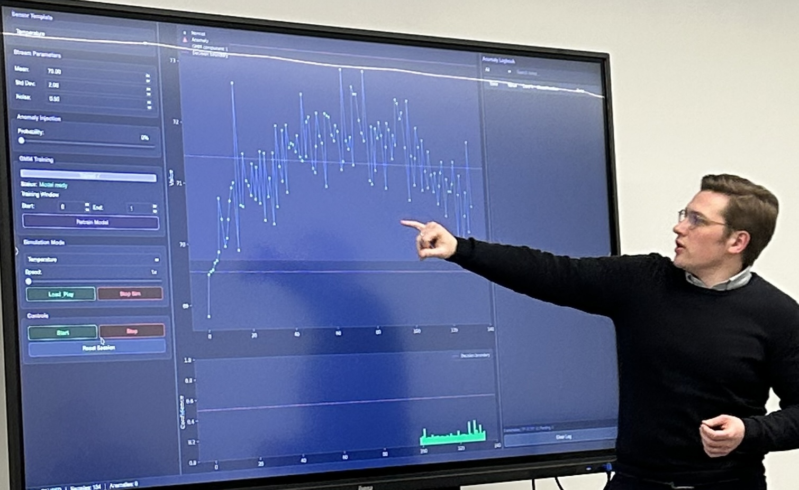

# Predictive Maintenance Demonstrator

An interactive desktop application demonstrating how **unsupervised anomaly detection** can support **smart manufacturing**, demonstrated during a workshop at the [AMBITION Industry Fair 2026](https://www.ambition-industry.be/) in Liège, Belgium, as part of the Interreg DIGIMACH project (https://www.interregmeuserhine.eu/en/projects/digimach/).

  <table>
    <tr>
      <td></td>
      <td></td>
    </tr>
  </table>
---

## Purpose

Modern manufacturing generates continuous streams of sensor data. Labelled failure examples are rare or non-existent, making supervised approaches impractical. This demonstrator shows how a Gaussian Mixture Model (GMM) trained entirely on *normal* operating data can:

- Learn what "normal" looks like — without any labelled anomalies
- Flag deviations from that baseline in real time
- Be updated incrementally as the operating regime changes
- Remain under human oversight through an operator logbook

The application is intentionally self-contained and runs on a single laptop, making it suitable for live workshop walkthroughs.

---

## Core Components

### 1 — Sensor Data Input (Simulated)

`core/data_generator.py` — `DataGenerator`

A `QTimer` fires every 100 ms and emits a synthetic sensor reading. Three sensor templates are included (Temperature, Vibration, Pressure). Each reading is a sum of:

- A configurable Gaussian base distribution (mean ± std)
- A slow sinusoidal drift (period ≈ 30 s) to simulate process warm-up / cool-down
- Random Gaussian noise
- Randomly injected spike anomalies at a configurable probability

A CSV-replay mode (`core/simulation_loader.py` — `SimulationPlayer`) can play back pre-generated scenarios (thermal runaway, bearing failure ramp-up, pressure drops) with realistic inter-row timing, useful for repeatable demonstrations.

### 2 — Unsupervised Anomaly Detection

`core/anomaly_detector.py` — `AnomalyDetector`

A GMM (scikit-learn `GaussianMixture`) is fitted on the first 100 incoming samples using `StandardScaler` + full-covariance estimation. **No labels are used at any stage.**

Detection works by scoring each incoming sample with the GMM log-likelihood. Samples that fall below the 2nd-percentile threshold of the training distribution are flagged as anomalies. A sigmoid transform converts the raw score gap into a 0–1 confidence value shown in the UI.

### 3 — Model Update Mechanism

`AnomalyDetector.retrain(start, end)`

As operating conditions drift, the model can be retrained on any user-selected window of the accumulated sample buffer. This incremental update mechanism illustrates a core principle of reliable AI in production: rather than a static one-shot model, the detector can track shifts in the process without requiring labelled data or restarting the application.

### 4 — Human-Centric Oversight (Logbook)

`ui/logbook_panel.py` — `LogbookPanel`

Every flagged anomaly is appended to a scrollable logbook. Operators can:

- **Classify** each alert as *True Positive* or *False Positive* (or leave it *Unclassified*)
- **Add free-text comments** to capture domain knowledge (e.g. "planned maintenance spike")
- **Filter and search** the log by classification or keyword
- **Export** the full log as a CSV for post-session analysis

This keeps the human in the loop: the model proposes, the operator decides. Classification corrections are stored locally and can inform future retraining cycles. An aggregate *Dashboard* dialog (non-modal, auto-refreshes every 5 s) shows TP/FP breakdown as a pie chart alongside running statistics.

---

## Architecture Overview

All processing runs on the Qt event loop — no threads, no shared mutable state.

```
QTimer (100 ms)
    └─► DataGenerator._generate_tick()
            └─► new_sample(timestamp, value, is_injected)
                    └─► AnomalyDetector.feed()
                            └─► detection_ready(DetectionResult)
                                    ├─► VisualizationPanel.add_point()  [sets dirty flag]
                                    └─► LogbookPanel.add_anomaly()       [anomalies only]

QTimer (50 ms)
    └─► VisualizationPanel._redraw()   [only when dirty flag is set]
```

During simulation mode, `SimulationPlayer` replays a CSV row-by-row using `QTimer.singleShot` with the original inter-sample time deltas, feeding the same `new_sample` signal into the detector.

The main window (`ui/main_window.py`) owns every object and performs all signal wiring; panels are passive receivers. Application lifecycle is modelled with an `AppState` enum (`IDLE → TRAINING → RUNNING / PAUSED / SIMULATION_RUNNING`).

---

## Code Structure

```
ambition_fair_demonstrator/
├── main.py                      # Entry point: Fusion style + dark matplotlib theme
├── pyproject.toml               # Dependencies and build config (uv / hatchling)
│
├── core/
│   ├── data_generator.py        # DataGenerator — QTimer-driven synthetic stream
│   ├── anomaly_detector.py      # AnomalyDetector — GMM scoring via scikit-learn
│   └── simulation_loader.py     # SimulationPlayer — CSV replay + scenario generation
│
├── ui/
│   ├── main_window.py           # MainWindow — owns all objects, wires all signals
│   ├── config_panel.py          # Left sidebar: template, stream params, GMM, sim controls
│   ├── visualization_panel.py   # Centre: embedded matplotlib chart (dirty-flag redraw)
│   ├── logbook_panel.py         # Right sidebar: anomaly table with TP/FP classification
│   └── dashboard_dialog.py      # Non-modal stats popup with pie chart
│
├── utils/
│   └── ring_buffer.py           # O(1) numpy ring buffer (chart sliding window, 300 samples)
│
└── assets/
    ├── style.qss                # Dracula-inspired dark theme
    └── simulations/             # Auto-generated scenario CSVs (created on first run)
        ├── scenario_temperature.csv
        ├── scenario_vibration.csv
        └── scenario_pressure.csv
```

---

## Getting Started

### Prerequisites

- Python 3.9 or newer
- [uv](https://github.com/astral-sh/uv) — fast Python package manager

### Install and run

```bash
uv sync            # creates .venv and installs all dependencies
uv run python main.py
```

Simulation CSVs in `assets/simulations/` are generated automatically on first launch.

---

## Usage Walkthrough

1. **Live stream** — select a sensor template, adjust parameters if desired, then click **Start**. After 100 samples the GMM trains automatically and anomaly detection activates.
2. **Inject anomalies** — drag the *Anomaly Probability* slider to increase the spike rate and see red triangles appear on the chart in real time.
3. **Classify findings** — in the logbook on the right, use the *Classification* dropdown to mark alerts as **TP** or **FP** and add free-text notes.
4. **Simulation replay** — choose a pre-built scenario and click **Load & Play**. Use the speed slider (1×–10×) for faster demos.
5. **Dashboard** — open **View → Dashboard** (`Ctrl+D`) for a live TP/FP summary and classification pie chart.
6. **Export** — **File → Export Log…** (`Ctrl+S`) writes the anomaly logbook to CSV.
7. **Reset** — **File → New Session** (`Ctrl+N`) clears all data and returns to idle.

---

## Dependencies

| Package | Role |
|---------|------|
| PyQt5 | GUI framework and event loop |
| matplotlib | Embedded live chart (Qt5Agg backend) |
| scikit-learn | Gaussian Mixture Model + StandardScaler |
| numpy | Data generation and ring buffer |
| pandas | CSV import/export |
